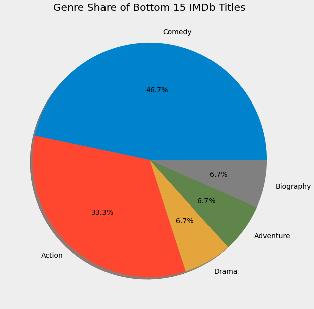

# Predicting IMDb Ratings

To advance my knowledge of machine learning algorithms, I decided to work with [IMDb Datasets](https://www.imdb.com/interfaces/), a collection of seven tab-seperated-values files cataloging identifying features of every movie, TV episode, and short film title on IMDB. Of the seven files, I downloaded four that contained information about the director, writer, genre of close to one million titles. Of those one million, I kept only original titles, and only movies.

# Data Cleaning and Exploratory Data Analysis

I decided to use these features in my data set: year, writer, director, genre, and runtime. I also created a metric called "score" whose formula was:

> score = (5-imdb_rating) * total_votes

I did this to differentiate high rated but small independent films with large blockbusters. I wanted large, high rated blockbusters with lots of votes (ex: Shawshank Redemption, Forrest Gump, Godfather) to be ranked higher than small independent films that are also ranked high. **I only used this 'score' metric for EDA, and discarded it with I started. my ML models.**

I wanted to know what the best movies were, so I ranked every movie by my score metric. Here are some of the results:

Many of the top movies were filled with drama, crime and action. This makes sense. When ranking the 15 best movies, 2/3 of them are either drama films or action films:

I also wanted to see what some of the worst movies were:

No surprises here. After ranking the worst movies, I discovered that half of them were comedies:

# Top Heavy-ness of Hollywood

I quickly realized that the Hollywood industry is very top heavy; there are very few movies that crack a certain threshold. The graphs below shows this concept at work. 

# Accounting for Top Heavy-ness

I accounted for this by changing how I categorized the writer and director features in my data. Instead of giving every writer and director in my dataset their own `.get_dummies()` column (would have been 132,000 columns), I only did so for the top 200 writers and directors and put the rest of them in their own column titled `unknown`. The slide below visualizes this idea.

# Learning Algorithms

Since all my data was numerical (after putting genre, writer, and director into `.get_dummies()` columns) I ran three **regression models** using [scikit-learn, a Python machine learning library](https://scikit-learn.org/stable/). I ran Linear Regression, Random Forest Regression, and Gradient Boosting Regression. I also ran a GridSearchCV on the Gradient Boosting Regression to find the best hyperparemeters. The Root Mean Squared Errors are below:

Graph visualizing the RMSE's:

Graph visualizing the RMSE's without Linear Regression, since that had an unusually high RMSE:

# Conclusion

My Gradient Boosting model finished with the best score, and GridSearchCV pushed it along a tad farther.

# Next Steps

* I'd like to run more GridSearches, specifically on the Random Forest Model to see if the score could beat that of Gradient Boosting. 

* I'd like to look at movie reviews and do some Natural Language Processing to gauge sentiment and predict rating

* I'd like to use Amazon Web Services to have more RAM at my disposal and work with more data.

